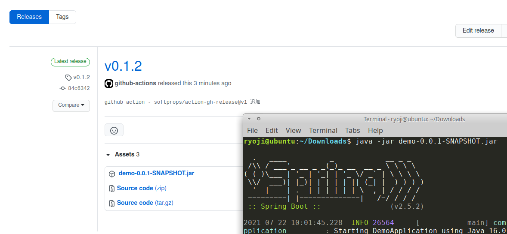

1. Gradleを使って、gitの情報をSpringに埋め込む
2. Gitのtag機能を使って、バージョン情報を与える
3. Github actionsを使って、自動化を始める
4. Github actionsを使って、アプリ配布まで自動化する

# 1. Gradleを使って、gitの情報をSpringに埋め込む


Gradleを選択。Mavenの別表記みたいなもの


IntelliJで、ファイル＞開く。

自動的に必要なライブラリはダウンロードされる。右にGradleメニューがある。


gitの情報を埋め込むためのライブラリを追加する。(このコミット https://github.com/growingspaghetti/temp-github-actions-release-spring/commit/ac9ec47c7858b1e133c288dbb707967203bdcc1e )


右のこのメニューをクリック


build/resources/main/の下にgit.propertiesというファイルが生成されるようになっている。


それを読み込んで、(このコミット https://github.com/growingspaghetti/temp-github-actions-release-spring/commit/ac9ec47c7858b1e133c288dbb707967203bdcc1e )


表示できるようになっている。

```
./gradlew bootRun
```

でSpringウェブサーバー起動


以上、情報はSpringの公式ホームページから。

- Git 情報を生成する https://spring.pleiades.io/spring-boot/docs/current/reference/html/howto.html#howto.build
- https://www.baeldung.com/properties-with-spring (English)

# 2. Gitのtag機能を使って、バージョン情報を与える

```
git tag v1.2.3
```

みたいにする。1のところはメジャーバージョン、2のところはマイナーバージョン、3のところはバグ対応バージョン。


versionのところにgitのタグ情報が表示された。

以上、情報はGitの公式ホームページから。タグを削除したり、ずっと前のコミットにタグを付与したりすることもできる。

- https://git-scm.com/book/ja/v2/Git-%E3%81%AE%E5%9F%BA%E6%9C%AC-%E3%82%BF%E3%82%B0


なお、gitではソースコードそのものとタグは別の線で送られるので、--tagsを付けないとタグの情報がgithubにプッシュされない。

# 3. Github actionsを使って、自動化を始める

これを継続的デリバリーと呼ぶ。

「GradleでのJavaのビルドとテスト」 https://docs.github.com/ja/actions/guides/building-and-testing-java-with-gradle

Githubのこの機能を使う。


.github/workflowsというディレクトリを作り、そこにyamlという形式の設定ファイルを置く。名前は何でもいいし、何個あってもいい。

適当に完成版はこちら https://github.com/growingspaghetti/temp-github-actions-release-spring/blob/main/.github/workflows/ryoji.yaml

次の2つの部分が「GradleでのJavaのビルドとテスト」の内容とは異なっている。

- \
  この設定が利用される条件が追加されている。gitのブランチ名がmainの時と、tagのコミットにバージョンがある時の両方。
  参考に、例えば、[https://nju33.com/notes/github-actions/articles](https://nju33.com/notes/github-actions/articles/%E3%83%90%E3%83%BC%E3%82%B8%E3%83%A7%E3%83%B3%E3%82%BF%E3%82%B0%E3%82%92%E3%83%97%E3%83%83%E3%82%B7%E3%83%A5%E3%81%97%E3%81%9F%E6%99%82%E3%81%AE%E3%81%BF%E5%AE%9F%E8%A1%8C#%E3%83%90%E3%83%BC%E3%82%B8%E3%83%A7%E3%83%B3%E3%82%BF%E3%82%B0%E3%82%92%E3%83%97%E3%83%83%E3%82%B7%E3%83%A5%E3%81%97%E3%81%9F%E6%99%82%E3%81%AE%E3%81%BF%E5%AE%9F%E8%A1%8C)
  
- \
  アプリ配布用。後で説明。
  
で、これ、Github Actionsの設定ファイルがあると、Githubは


彼らのLinuxサーバーでソースコードに対して処理を行ってくれる。この一連の自動処理をパイプラインという。


その点をクリックすると実行している、または実行した処理の状況を教えてくれる。

# 4. Github actionsを使って、アプリ配布まで自動化する

アプリ配布の処理も行える。

この
```yaml
      - name: Release
        uses: softprops/action-gh-release@v1
        if: startsWith(github.ref, 'refs/tags/')
        with:
          files: |
            build/libs/*-SNAPSHOT.jar
        env:
          GITHUB_TOKEN: ${{ secrets.GITHUB_TOKEN }}
```
ってのがあるために、gitのタグで管理してるバージョンがついてるコミットが送られてきたら、そのコミットのところで自動的にコンパイルしたアプリをリリースページを作って置いといてくれるし、





この
```yaml
      - name: Build artifact
        uses: actions/upload-artifact@v2
        with:
          path: build/libs/*-SNAPSHOT.jar
```
ってのがあるために、mainブランチに変化があるたびに、ソースをビルドして、最新状態のアプリを提示しておいてくれる。 そうするとまあ、こちらのパソコンでは動いてるのにあちらのパソコンでは動いてないと言う、我々の持ってるソースコード違うんじゃない、なんかコミットしてないんじゃない、という事態が避けられる。githubでコンパイルしたのが正しいと。


以上、それぞれアプリ配布の処理はこちらに詳細がある。
- https://github.com/softprops/action-gh-release
- https://github.com/actions/upload-artifact


リリースが自動で作成されるたびにgithubから結果通知メールが来た。
